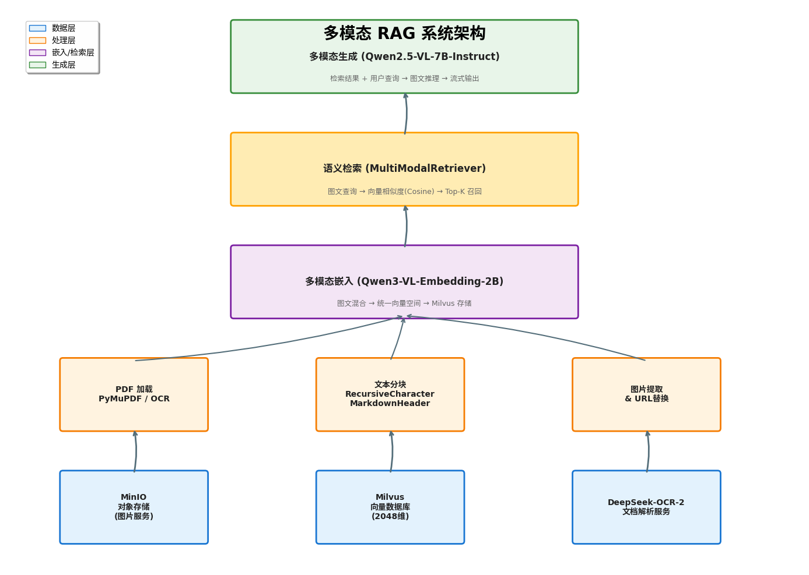
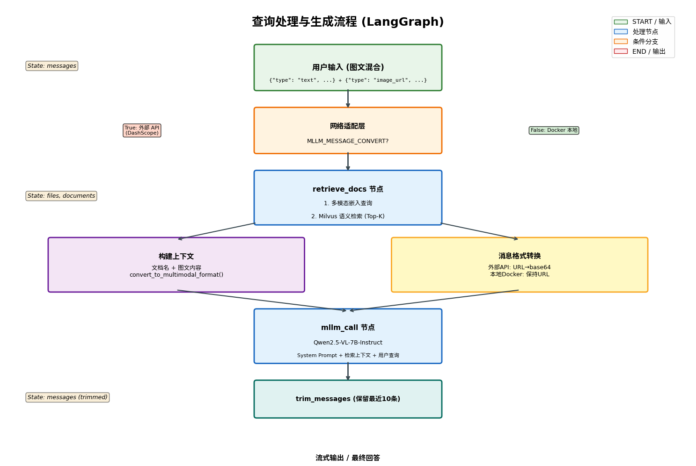
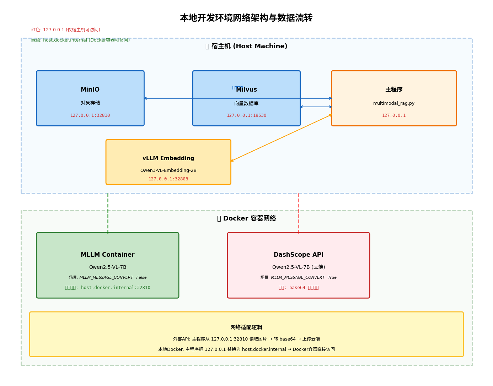
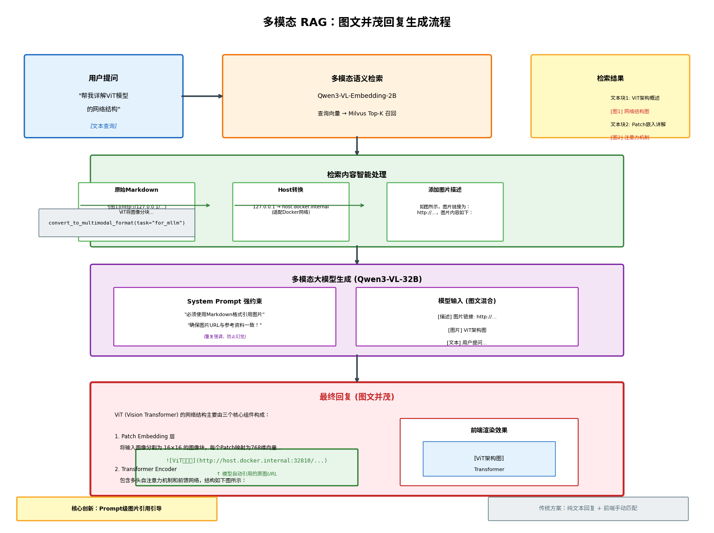

# OmniRAG：智能多模态检索增强生成系统

## 项目核心

OmniRAG 是一个面向复杂文档场景的**多模态 RAG 系统**，突破传统文本检索局限，实现图文混合理解、智能路由决策与可视化交互的完整闭环。

## 技术亮点

1. **端到端多模态**：图文混合嵌入、检索、生成，构建**统一的图文语义空间**，并非简单的"文本+RAG+图片拼接"；
2. **智能文档路由**：双模式 PDF 解析 (PyMuPDF / DeepSeek-OCR-2)，根据文档复杂度选择解析策略，平衡速度与精度；
3. **图文并茂交互**：突破传统 RAG "纯文本回复 + 前端手动匹配"的割裂体验，实现**模型原生的图文混排输出；**
4. **工程化网络适配**：解决本地开发环境的 Docker 网络隔离问题，无需修改代码即可切换部署模式；
5. **生产级细节**：消息裁剪、错误降级、流式输出、图片 URL 自动托管。

## 技术选型

| 技术                      | 用途         | 优势                                       |
| ------------------------- | ------------ | ------------------------------------------ |
| **PyMuPDF**               | 简单文档解析 | 对仅包含文本和图片的文档实现快读加载       |
| **DeepSeek-OCR-2**        | 复杂文档解析 | 对包含表格和数学公式的复杂文档提升解析效果 |
| **MinIO**                 | 图片服务     | 本地 S3 兼容对象存储                       |
| **Milvus**                | 向量数据库   | 十亿级向量高性能检索                       |
| **vLLM**                  | 模型部署框架 | PagedAttention 高吞吐、低延迟              |
| **Qwen3-VL-Embedding-2B** | 嵌入模型     | 原生多模态，2048-dim                       |
| **Qwen3-VL-32B-Instruct** | 生成模型     | 图文联合推理，指令遵循能力强               |
| **LangGraph**             | 工作流引擎   | 状态机管理，支持循环、人机交互             |

## 系统架构

### 核心组件
- **数据层**: MinIO (图片存储) + Milvus (向量数据库)
- **处理层**: 双模式 PDF 解析 (PyMuPDF / DeepSeek-OCR-2)
- **嵌入层**: Qwen3-VL-Embedding-2B (2048维图文联合嵌入)
- **检索层**: 语义检索 + Cosine 相似度排序
- **生成层**: Qwen3-VL-32B-Instruct + LangGraph 工作流

## 文档处理流程

针对不同类型的 PDF 文档，系统采用不同的解析策略：

**简单文档 (无表格、公式)**

- 使用 PyMuPDF 快速提取，保持阅读顺序，适合论文、报告等标准文档。

**复杂文档 (表格、复杂公式)**

- 使用 DeepSeek-OCR-2 视觉模型解析，准确识别表格结构和数学公式。

## 查询处理流程

基于 LangGraph 的状态机工作流：

## 网络适配策略

系统支持两种 MLLM 部署模式，自动适配网络环境：

| 模式        | 配置                         | 图片处理方式                           |
| ----------- | ---------------------------- | -------------------------------------- |
| 外部 API    | `MLLM_MESSAGE_CONVERT=True`  | 本地读取 → base64 编码 → 上传云端      |
| Docker 本地 | `MLLM_MESSAGE_CONVERT=False` | URL host 替换为 `host.docker.internal` |

## 图文混排回复

